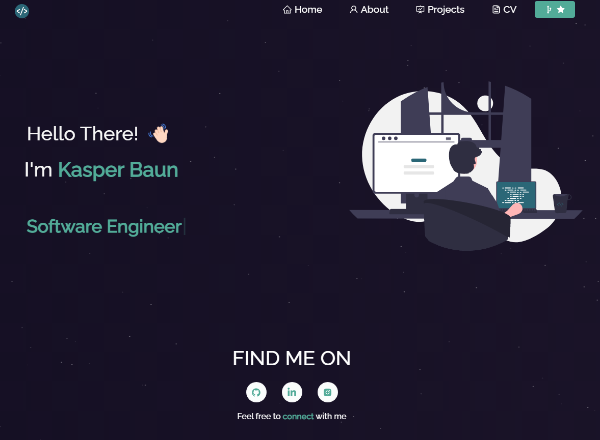

<h2 align="center"> 
    Personal Portfolio Website 
  <a href="https://www.kasperbaun.dk/" target="blank" rel="nofollow"> Link </a href>
</h2>

    

  
 
 Feel free to fork and modify for your own usage, but please give due credit by linking back to [KasperBaun](https://github.com/KasperBaun/Portfolio). Thanks! 

 
 ### Technologies
 This project was built using:
 - React.js
 - Node.js
 - VSC 
 - React Router
 - React Bootstrap
 
 It is hosted on RaspberryPi Zero 2W running Ubuntu Server 20.04. 
 CI/CD Pipeline created with Github Actions Runner(self-hosted), Docker and Gated Commits!

 ## 🛠 Installation and Setup Instructions

1. Installation: `npm install`

2. In the project directory, you can run: `npm start`

Runs the app in the development mode.\
Open [http://localhost:3000](http://localhost:3000) to view it in the browser.
The page will reload if you make edits.
 
 ### Show some love!
 Give a ⭐ if you like this website!

